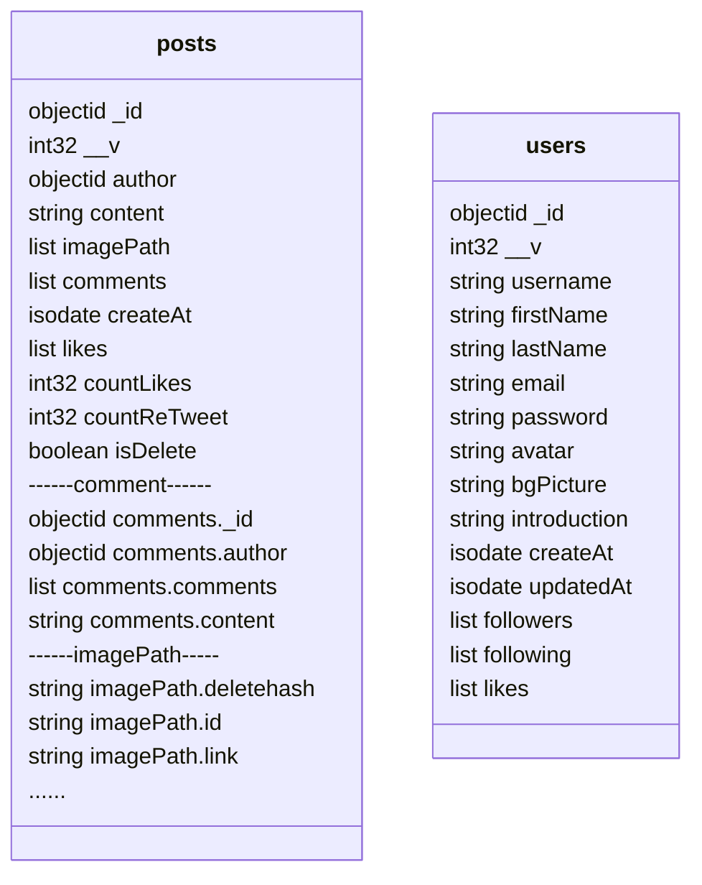

# [Server of a Twitter clone](https://github.com/zhenyuefu/technoweb-twitter-server)

**Projet de l’UE LU3IN017 TechnoWeb de Sorbonne Universite**

Lien pour le [`client`](https://github.com/zhenyuefu/technoweb-twitter)

Lien pour [`Api Document`](https://documenter.getpostman.com/view/19358559/UyxdLVAZ ) host sur postman

Le code du serveur est maintenant hébergé sur heroku 

```
https://apitw.fuzy.tech
```

### Exécuter sur votre ordinateur

1. Clone this repo

   ```sh
   git clone https://github.com/zhenyuefu/technoweb-twitter-server.git
   ```

2. Créer un fichier .env à la racine du projet. Les variables d'environnement suivantes doivent être incluses dans le fichier

   ```
   PORT=<default_8000>
   MONGODB_URI=<your_mongodb_url>
   SESSION_SECRET=<your_secret>
   REDIS_URL=<your_redis_connection_url_for_example:redis://127.0.0.1:6379>
   // redis used to store the session, if you don't want to use it , delete "store" option of app.use(session) in middleware/index.ts, you can also store in mongodb with package "connect-mongo"
   // see https://github.com/jdesboeufs/connect-mongo
   ```

3. Pour mongodb, je recommande d'utiliser [l'atlas](https://www.mongodb.com/atlas/database) en ligne. Si vous utilisez un mongodb local, veuillez vous assurer que votre `mongod instances` est un `ReplicaSet`. See [Deploy a Replica Set for Testing and Development](https://www.mongodb.com/docs/manual/tutorial/deploy-replica-set-for-testing/)

4. run yarn pour installer toutes les dépendances

   ```
   yarn
   ```

5. Maintenant, votre serveur est lance.

   ```
   yarn dev
   ```

### Description

##### Architecture du code 

```
src/
├── db                         // model de database
│   ├── db.ts
│   └── models
│       ├── comment.models.ts
│       ├── post.models.ts
│       └── user.models.ts
├── middleware                 // chargement de tous les middleware
│   └── index.ts
├── routes                     // route api
│   ├── auth.jwt.bak
│   ├── auth.ts
│   ├── index.ts
│   ├── post.ts
│   ├── search.ts
│   └── user.ts
├── server.ts                  // entrée du serveur
└── types
    └── index.ts               // définitions des types
```

##### Packages utilisés

```
"bcrypt" Utilisé pour crypter les mots de passe
"cors"
"dotenv" Lire les variables d'environnement
"express"
"express-session"
"mongoose"
"mongoose-unique-validator" Veillez à ce que les noms d'utilisateur et les adresses électroniques soient uniques et insensibles à la casse.
"passport"
"passport-local" Utilisé pour gérer les sessions de connexion
```

##### Schéma de la base de données

Si votre éditeur n'affiche pas le diagramme ci-dessous, vous pouvez cliquer sur [ce lien](https://github.com/zhenyuefu/technoweb-twitter-server#schéma-de-la-base-de-données) pour aller sur github et le visualiser en ligne.



